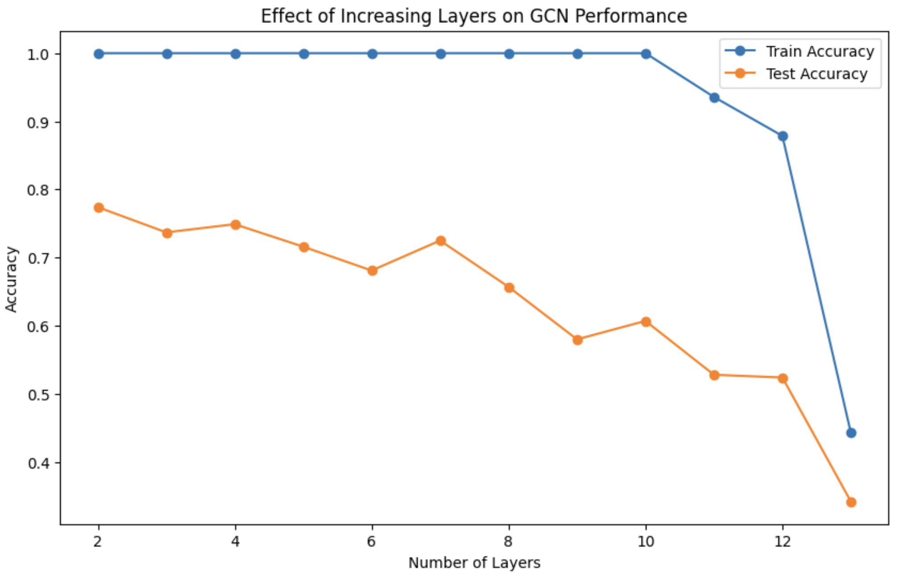
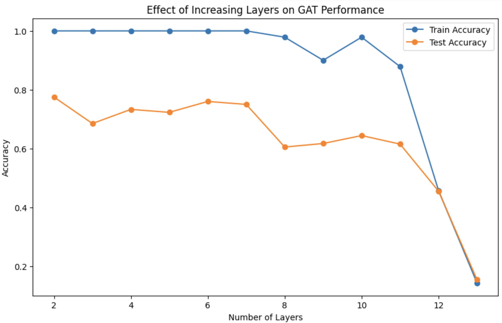

# DSC Capstone Project 1 Checkpoint

## Introduction

### Overview of Geometric Deep Learning

Geometric deep learning is a subset of deep learning in which deep learning techniques are used on data in the non-Euclidean space such as graphs and manifolds. This field aim to capture the relationships between nodes or entities within a network to learn learn meaningful representation for data of complex nature.

### Tasks Solvable with Graph Neural Networks (GNNs)

GNNs are suitable mainly for more or less three tasks:

- **Node Classification**: Assigning labels to individual nodes within a graph. Some tasks include fraud detection in social networks.
- **Link Prediction**: Predicting the connections between nodes in a graph, such as drug interactions or recommendation systems.
- **Graph Classification**: Categorizing entire graphs, applicable in fields like drug discovery (e.g., classifying chemical compounds) or protein classification.

Often times, especially first to types of tasks, the tasks are semi-supervised, where a subset of nodes and/or edges are labeled and the task is to predict/classify the missing data within a graph. 

### Limitations of Existing Models
Despite their success, GNNs face several challenges, including:

- **Oversquashing**: Information from distant nodes can become compressed as it passes through layers, limiting the ability of the model to capture long-range dependencies effectively.
- **Oversmoothing**: As GNNs go deeper, node features can become overly similar, making it difficult to distinguish between different classes or nodes.

These challenges, along with high computational complexity and scalability issues, can hinder GNN performance, especially on large, real-world graphs.

---

## Method

### Semi-Supervised Classification with Graph Convolutional Networks (GCNs)

In our capstone, we explored **Graph Convolutional Networks (GCNs)** for semi-supervised classification on graph data. GCNs facilitate learning by propagating information across the graph structure, allowing nodes to share relevant features with their neighbors. This method maintains locality and utilizes both labeled and unlabeled data for improved classification accuracy.

This work builds on the original architecture introduced in [Semi-Supervised Classification with Graph Convolutional Networks](https://arxiv.org/abs/1609.02907).

#### Loss Function

The model’s objective function combines a supervised loss with a regularization term to enforce smoothness over the graph:

$$
\mathcal{L} = \mathcal{L}_0 + \lambda \mathcal{L}_{\text{reg}}, \quad \text{where } \mathcal{L}_{\text{reg}} = \sum_{i,j} A_{ij} ||f(X_i) - f(X_j)||^2
$$

Here, $A_{ij}$ represents connections between nodes $ i $ and $j$, and the regularization term minimizes differences in feature values across connected nodes, promoting smoothness in the learned representations.

Single Layer:

$$
H^{(l+1)} = \sigma (\tilde{D}^{- \frac{1}{2}} \tilde{A} \tilde{D}^{- \frac{1}{2}} H^{(l)} W^{(l)}) . 
$$

- $\tilde{A} = A + I_N$ --> adjacency matrix undirected graph $G$ with added self connections is a degree matrix 

- $\tilde{D}$ is a degree matrix of summing across the rows of $\tilde{A}$

- $W^{l}$ --> trainable weights

- $H^{(l)}$ is considered the matrix of activations (input into the the fed layer, .i.e $H^{(0)}$ = X)

#### Spectral Convolution on Graphs

The motivation for propagating features in GCNs stems from spectral graph theory, which enables graph convolutions in the spectral domain:

$$
g_\theta * x = U g_\theta(\Lambda) U^T x 
$$

where $ U $ is the matrix of eigenvectors for the normalized graph Laplacian $ L = I_N - D^{-\frac{1}{2}} A D^{-\frac{1}{2}} $.

**Decomposition Steps:**

1. **Transform to the Fourier Domain**: $ \tilde{x} = U^T x $.
2. **Apply Convolution in the Fourier Domain**: $ \tilde{y} = g_\theta(\Lambda) * \tilde{x} $.
3. **Transform Back to the Standard Domain**: $ y = U * \tilde{y} $.

#### Filter Interpretation

Filtering in the spectral domain allows for flexible manipulation of signal frequencies:

- **Low-pass filters** reduce high frequencies (suppressing eigenvalues with large magnitudes), resulting in smoother signals across nodes.
- **High-pass filters** enhance high frequencies, emphasizing sharp changes between connected nodes.

#### Graph Laplacian Interpretation

The graph Laplacian, $L$, encodes smoothness across nodes and edges. Given a graph signal $x$, we can measure smoothness as:

$$x^T L x = \sum_{i,j} A_{ij}(x_i - x_j)^2.$$

This term sums differences in feature values across connected nodes, penalizing larger differences to promote smoothness. For connected nodes $i$ and $j$, when $x_i = x_j$, the contribution is zero, while disconnected nodes are ignored.

### Chebyshev Polynomial Approximation

To avoid expensive eigenvector calculations, spectral filtering can be efficiently approximated using Chebyshev polynomials:

$$g_{\theta'}(\Lambda) \approx \sum_{k=0}^{K} \theta_k' T_k(\tilde{L})$$

where $ \tilde{\Lambda} = \frac{2}{\lambda_{\max}} \Lambda - I_N $, and $ \lambda_{\max} $ is the largest eigenvalue of $ L $. The coefficients $\theta ' \in \mathbb{R}^K$ is now a vector of Chebyshev coefficients. $ T_k(x) $ offer a **$ K $-localized filter** that captures information within each node’s $ K $-hop neighborhood, efficiently capturing local structure in the graph.

**Simplified Linear Model**

With $ K = 1 $ , the model reduces to:

$$
g_{\theta '} * x \approx \theta_0 'x + \theta_1 ' (L- I-N)x = \theta_0 ' - \theta_1 ' D^{- \frac{1}{2}}AD^{-\frac{1}{2}}x
$$

=> changed to a single parameter

$$
g_{\theta'} * x \approx \theta \left( I_N + D^{-\frac{1}{2}} A D^{-\frac{1}{2}} \right) x
$$

Using the renormalization trick stabilizes gradients, making deeper networks feasible to train.

**Final Model Output**

The final GCN model for input $ X \in \mathbb{R}^{N \times C} $ produces output:

$$
Z = \left( I_N + D^{-\frac{1}{2}} A D^{-\frac{1}{2}} \right) X \Theta
$$

where $ \Theta $ are learned filter parameters. This structure efficiently leverages graph connectivity, enabling scalable semi-supervised learning.

## Experiments

In this capstone project, we explored various geometric deep learning models, evaluating their performance across different datasets. The primary models studied were Graph Convolutional Networks (GCN), Graph Isomorphism Networks (GIN), and Graph Attention Networks (GAT). For all models, we used Adaptive Moment Estimation (Adam) as the optimizer and Cross Entropy Loss as the loss function. The results were recorded for three datasets: Cora, IMDB-BINARY, and ENZYMES.

**Test Accuracy Results**

| Model | Cora Accuracy | IMDB-BINARY Accuracy | ENZYMES Accuracy |
|-------|---------------|----------------------|------------------|
| GCN   | 0.819         | 0.6290               | 0.3017          |
| GIN   | 0.720         | 0.6457               | 0.2580          |
| GAT   | 0.7720        | 0.5014               | 0.2417          |

 GCN performed best on almost all the datasets, except for  the IMDB-BINARY which the GIN showed a relatively strong performance.

**Effect on Increasing Layers**

We also checked what happened when we added layers to both GAT and GCN models

        

Adding layers to both GCN and GAT models resulted in a general decrease in accuracy, a phenomenon likely due to oversquashing and oversmoothing. As more layers aggregate information from each node, the distinctiveness of each node's features may be lost, leading to reduced model performance. Specifically, as layers increase, node embeddings become increasingly similar, which limits the model’s ability to distinguish between different classes and reduces its discriminative power.

